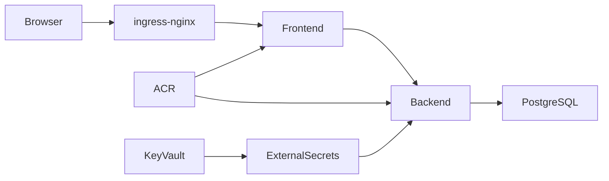

# Sample application delivery

The sample frontend proxies `/api/` to the Go backend. The backend obtains a
PostgreSQL TLS connection string from the `sample-database` ExternalSecret,
which reads Azure Key Vault through the existing workload identity.

Images are deliberately initialized as `registry.invalid` in the development
overlay. This prevents an unreviewed default image from being deployed. The
App delivery workflow builds immutable commit-SHA images, scans and attests
them, pushes to ACR, and commits the ACR references. Argo CD observes that
commit and deploys it.

Before first exposure, set a real hostname in
`kubernetes/apps/sample/base/ingress.yaml`, create DNS for the ingress public
endpoint (or configure the Application Gateway backend integration), and
provision `sample-app-tls`. Use cert-manager with an approved issuer or import
a certificate through the approved operational path.
