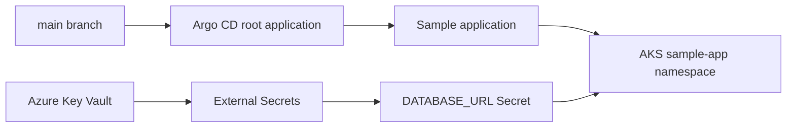

# GitOps with Argo CD

Argo CD is installed as a platform component, but applications are reconciled
from `kubernetes/argocd`. The root application watches child Application
objects; the sample application watches its Kustomize development overlay.



Both Applications use automated sync, self-healing, and pruning. The `platform`
AppProject permits only this repository, the in-cluster API, and a narrow list
of workload resource types in `sample-app`.

## Bootstrap

Install the Phase 10 Helmfile, create the Key Vault `ClusterSecretStore`, wait
for Argo CD, then run:

```bash
./kubernetes/argocd/bootstrap.sh
argocd app get platform-applications
argocd app get sample-app-dev
```

The bootstrap manifest must already be in `main`, because the Applications
reconcile `main`. Use `argocd app sync sample-app-dev` only for an intentional
manual recovery; normal changes are committed and reconciled automatically.
